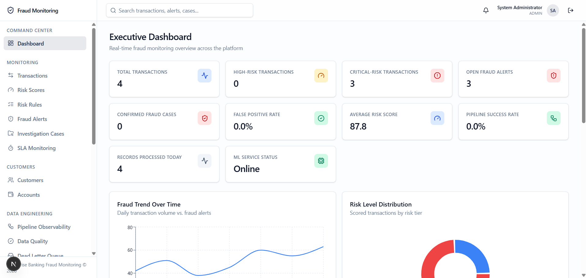
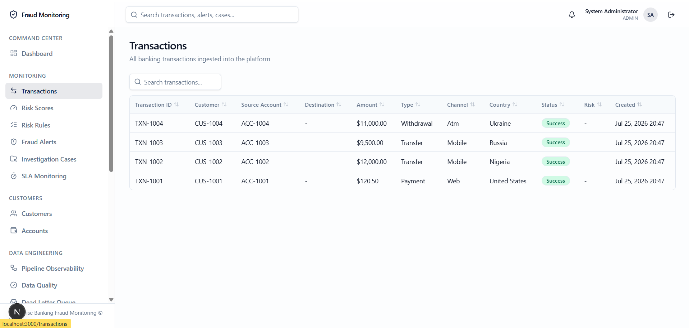
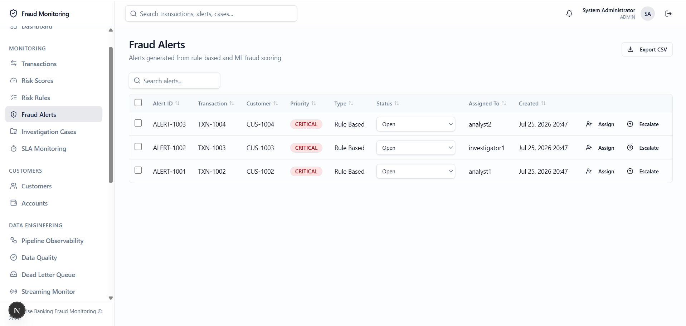
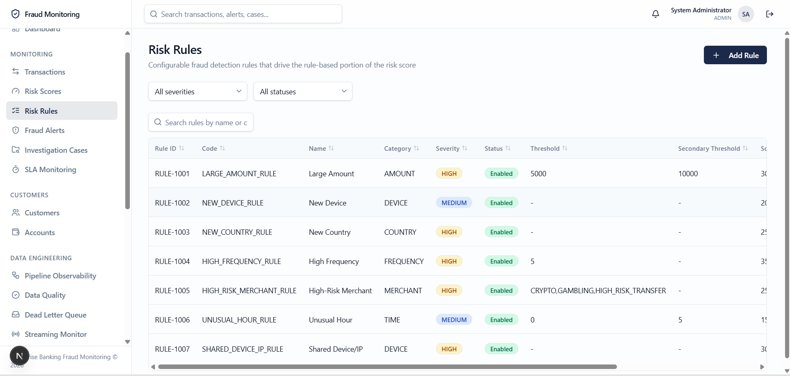

# Screenshots

This folder holds the UI screenshots referenced from the root
[README.md](../../README.md). Each image below shows a key surface of the
Enterprise Banking Fraud Monitoring Platform.

## Dashboard

High-level overview of monitored transaction volume, live risk scores, and
aggregate fraud metrics.

## Transactions

Searchable, filterable transaction ledger showing per-transaction risk levels
and scoring sources (rules engine vs. ML service).

## Alerts

Real-time fraud alerts raised when a transaction crosses the configured risk
threshold, with drill-down into the triggering signals.

## Additional view

Supplementary screen capturing extra platform detail.

> **Note:** An `ml-service.png` capture (showing the ML scoring service
> response/health) is still referenced from the root README but has not been
> added yet. Drop the PNG/JPEG in this folder and it will render here.
